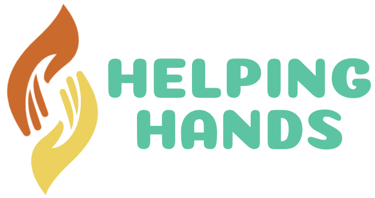

<p align="center">
  
</p>

<div align="center">
  
  <a href=""></a>
 </div>

## About

HelpingHands is an initiative to help the poor in need. We are creating a community that believes in helping each other can make the world a better place.
We're on a mission to create an impact on human lives.

> **Give Your Big Hand Forever.**
>
> **We’re Helping Today. Helping Tomorrow.**

## Installation

```bash
$ npm install
```

## Starting with component

```bash
$ npm run generate
```

## Running the app

```bash
# development
$ npm run start
```

## Test

```bash
# unit tests
$ npm run test

# test coverage
$ npm run test:cov
```

## Building the app

```bash
$ npm run build
```
