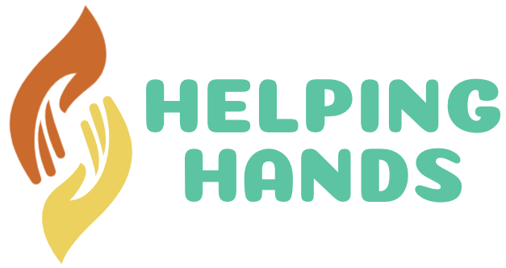

  

  
 

## About

HelpingHands is an initiative to help the poor in need. We are creting a community that believe in helping each other can make world better place.
We're on a mission to help the humanity by creating a bridge between contributors and NGO's.
We’re Helping Today. Helping Tommorow. Give Your Big Hand Forever

## Scripts

`npm run generate component`
`npm start`
`npm test`
`npm run build`
